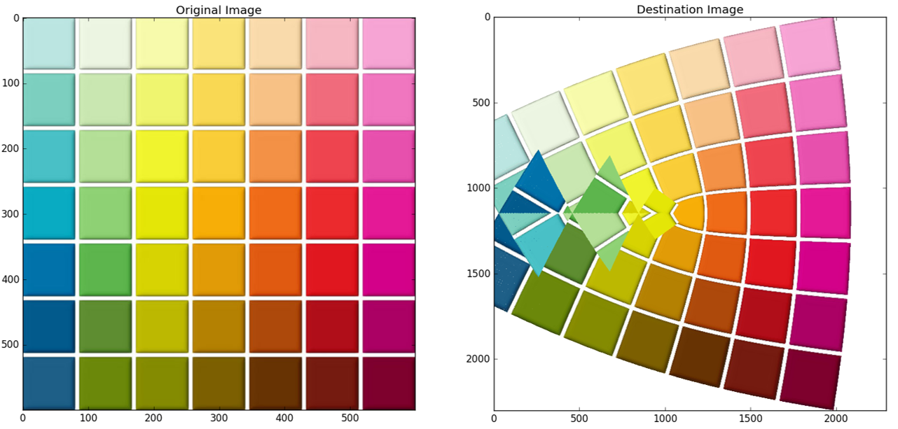

# Image Transformation
### Perform an arbitrary image transformation by complex mapping
This repo contains the source code used in a creative math project. Click [here](https://github.com/hanzhi713/Image-Transformation/blob/master/Image%20Transformation%20Based%20on%20Complex%20Mapping.pdf) to download the PPT.

You may need to adjust the size of the convolution kernel in accord with your function in order to obtain a smooth destination image
#### Example

=z^{1.2}})

##### Kernel size = 7x7

