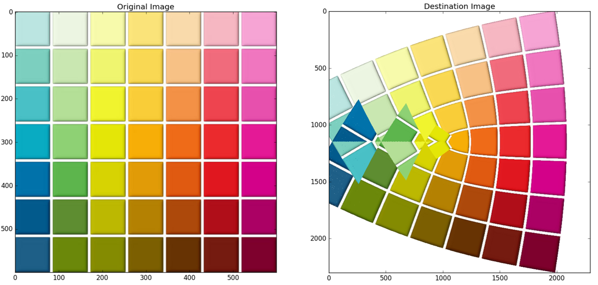

# Image-Transformation
### Perform an arbitrary image transformation by complex mapping
#####Remember to adjust the size of the convolution kernel in order to obtain a smooth destination image
####Example

 

#####Kernel size = 7x7

